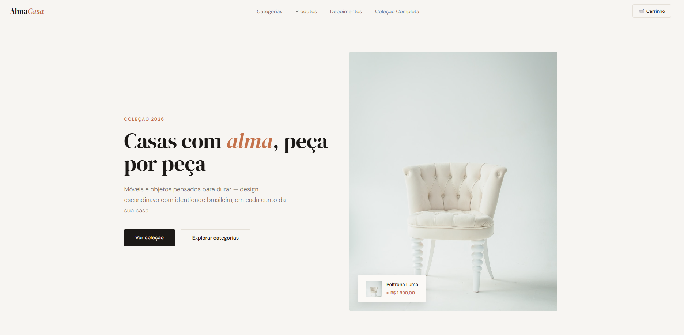

# Alma Casa — Landing Page

Landing page completa de e-commerce para uma loja fictícia de móveis e decoração, construída em HTML, CSS e JavaScript puro.

## O que foi feito
- Hero com produto em destaque e card de preço animado
- Navegação por categorias (Sala, Quarto, Escritório)
- Grid de produtos em destaque
- Banner institucional sobre materiais e curadoria
- Carrossel de depoimentos com scroll automático e pausa no hover
- Seção de blog com posts de inspiração
- FAQ com accordion animado
- Newsletter
- Footer completo com ícones de redes sociais em SVG
- Scroll reveal em todas as seções
- Totalmente responsivo, com suporte a prefers-reduced-motion

## Tecnologias
HTML · CSS · JavaScript

## Demo
🔗 [Ver online](https://elizandrasouzadev.github.io/alma-casa-landing)

## Preview

